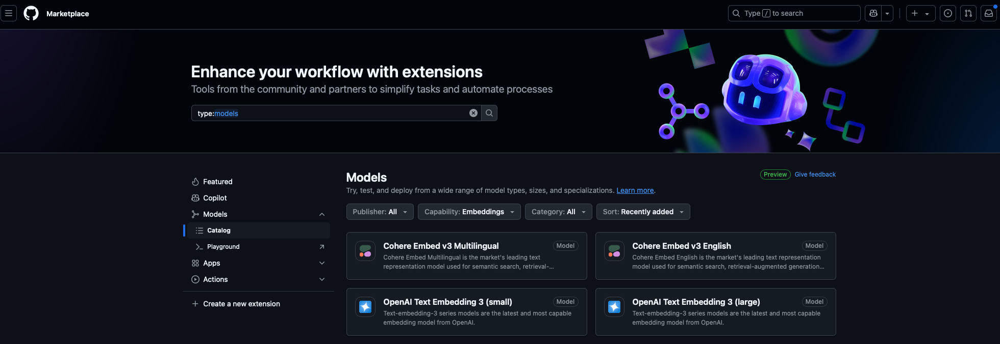
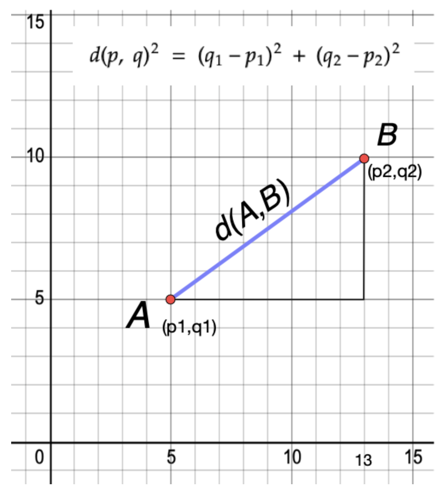
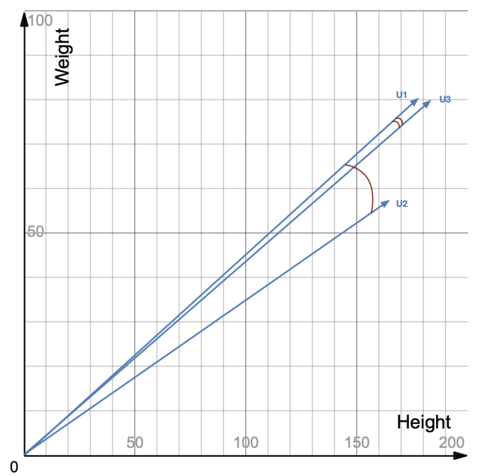
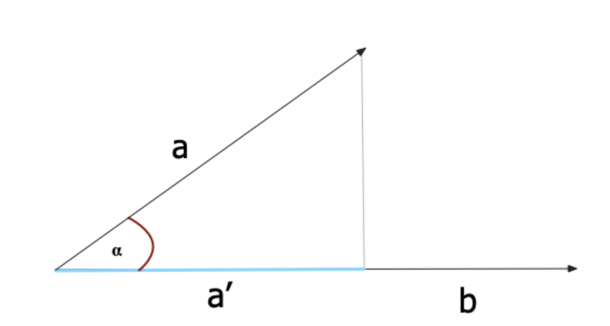

## Semantic search

In this guide we'll learn sematic search through Redis vector DB. Semantic search extends traditional database search methods to interpret the user's query and extract the documents that match the semantic meaning of the query. With the semantic search features, it is possible to query the database in natural language: it understands the semantics behind the query and returns meaningful results. 

Semantic similarity is achieved by generating a vectors that represents the features of the data under analysis because the vector is a convenient data structure to compress information and is easily manageable by a computer. Vectors are lists of floating point numbers that represent features of unstructured data that play a massive role in Machine Learning.

Vector search is a key function that can be performed between pairs of vectors. It is the process of finding data points that are similar to a given query vector in a set of vectors. Popular vector search uses include recommendation systems, image and video search, natural language processing, and anomaly detection. Distace metrics is used ti compute how similar ir dissimilar two vectors are.

## How to obtain vectors
Vectors represent unstructured data and are essentially lists of decimal numbers. When vectors are used in semantic search, we refer to vector embeddings. The term "embedding" helps reflect the transformation of data to a lower-dimensional space while preserving the features of the original data, so the vector embeds the structures and relationships of the original data which may be the semantic meaning of a paragraph or the attributes like colors, angles, lines, and shapes in a picture, and so on. 

Embedding models translate the human-perceived semantic similarity to the vector space. 
Example- 
Github Market place have hosted models which we could try free of cost. All it needs is a github account.


Output embedding dimesions for the above models - 
| Model Name                        | Output Embedding Dimension |
|-----------------------------------|----------------------------|
| Cohere Embed v3 Multilingual      | 1024                       |
| Cohere Embed v3 English           | 1024                       |
| OpenAI Text Embedding 3 (small)   | 1536                       |
| OpenAI Text Embedding 3 (large)   | 3072                       |

When a machine learning model generates vectors, they embed the distinctive features of data into floating point numbers of fixed size in a compact and dense representation and translate the human-perceived semantic similarity to the vector space. The semantic similarity of two objects (two texts expressing the same concepts and overall meaning or two similar pictures) translates to the "numerical similarity" of two vectors, which is calculated as the distance between vectors, a simple mathematical operation.

Comparisons between vectors occur in the same vector space, where the vectors must have the same size. Therefore, ensure that your data is embedded for ingestion and semantic search prompts using the same embedding model.
To get started, set up a Python virtual environment to isolate the required packages for your testing. This ensures a clean and manageable workspace. You can create and activate a virtual environment using the following commands:

```bash
# Create a virtual environment
python -m venv .venv

# Activate the virtual environment
# On Windows
env\Scripts\activate
# On macOS/Linux
source env/bin/activate
```

Once the virtual environment is activated, install the necessary packages using `pip`:

```bash
pip install -r requirements.txt
```
Create a `.env` file to securely store your API key. For this demo, we will use a GitHub token to connect to models hosted on the GitHub Marketplace.

## Install Redis Stack on Docker to test out semantic search 

https://redis.io/docs/latest/operate/oss_and_stack/install/install-stack/docker/

redis/redis-stack contains both Redis Stack server and Redis Insight. This container is best for local development because you can use the embedded Redis Insight to visualize your data.

To start a Redis Stack container using the redis-stack image, with persistent volume, run the below command

```bash
docker run -d --name redis-stack -p 6379:6379 -p 8001:8001 -v /Users/rashmikare/Learn/Repos/MyRepos/data:/data redis/redis-stack:latest
```

The docker run command above also exposes Redis Insight on port 8001. You can use Redis Insight by pointing your browser to localhost:8001.

## Cluster architecture in Redis (adiitional information)
Redis as a Vector databases can store vectors and index and search the vector space efficiently.
When deploying Redis Enterprise Software, several common topologies are available.

Single-node cluster – For local development or functional testing

Multi-node cluster on a single host – For a small-scale deployment that is similar to production

Multi-node cluster with multiple hosts – For more predictable performance or high availability compared to single-host deployments

https://redis.io/technology/redis-enterprise-cluster-architecture/

Sharding is a type of database partitioning that separates large databases into smaller, faster, and more easily managed parts. These smaller parts are called data shards. With sharding or partitioning, you are not restricted to storing data on the memory of a single computer. Another advantage of sharding is being able to use the computational power of multiple cores.

Redis cluster provides sharding and high availability. HA refers ti the cluster's ability to remain operational, even in the face of certain failures.

For more undertsanding refer to the below videos. <br>
https://youtu.be/N8BkmdZzxDg?si=eWseIPZbgQfzgK9P
<br>
https://youtu.be/3WOfXRjYnGA?si=rgPmA4C0eEmXa3o0

## What is distance metrics

Distance metrics is a score that determines how similar or dissimilar two vectors are. We mention the distance metrics in the schema which is used to create index. Redis supports 3 disatnce metrics.

1. Euclidian distance (L2)
Euclidean distance is one of the most used distance metrics and it calculates the distance between two data points on a plane. The example below can be easily expandable to N-dimensions. It works best with low-dimensional data and where the magnitude of the vectors is important to be measured.



2. Cosine similarity of two vectors (COSINE)
This gives good results for high dimensional vector spaces. It is a good choice for use cases like document similarity, image comparison, pose comparison (in computer vision) and much more. Differently from Internal product, cosine similarity looks only at the angle between two vectors to determine similarity. Specifically, it looks at the cosine of the angle.

In the image of three vectors in two-dimensional space below we can see that the vectors U1 and U3 have a small angle between them, which means they're more similar. U1 and U2 however have a bigger angle between their vectors, which means the vectors are less similar. Two vectors with exactly the same orientation have a cosine similarity of 1, whereas two vectors diametrically opposed to each other have a similarity of -1. Their magnitude is not of importance as this is a measure of orientation.


3. Internal product of two vectors (IP)
To determine similarity internal product looks at both angle and magnitude of vectors. Let's take two four-dimensional vectors. Then we multiply element-wise the ordered vectors, element by element, and in the end we sum the products. The result of a dot product of two vectors is a scalar.

a = (3, 6, 1, 8) b = (3, 2, 2, 1) a⋅b = 3x3 + 6x2 + 1x2 +8x1 = 9 + 12 + 2 + 8 = 31



Below indexing methods are supported in Redis.
FLAT method offers precision over speed for vector searches.
HNSW method offers high throughput with a little compromise on accuracy.

There are two supported types of vector queries in Redis: KNN and Range.Hybrid queries can work in both settings and combine elements of traditional search and VSS.
A vector search query on a vector field allows you to find all vectors in a vector space that are close to a given vector. You can query for the k-nearest neighbors or vectors within a given radius.


Three ost popular types of distance metrics.

Some useful Redis commands to execute in redis.cli
1. FT._LIST
2. FT.INFO <index_name>
3. FT.DROPINDEX <index_name>